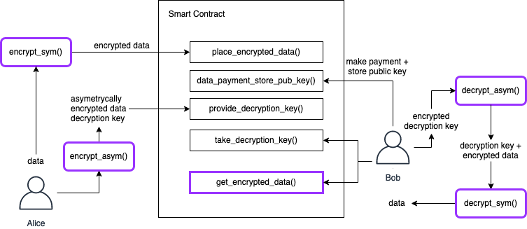

# Secure data exchange

Elliptic Curve Diffie-Hellman secure data exchange via smart contracts on Aeternity blockchain

This contract is acting intermediary for storing encrypted data and allowing payments and request for its decryption keys to be done on-chain.

## Flow



## Requirements
- Node, npm
- aeproject (`npm i aeproject -g`)
- Docker

## Test locally
```sh
$ git clone http://github.com/mradkov/secure-data-exchange
$ cd secure-data-exchange
$ npm i
$ aeproject env
$ aeproject test
```
